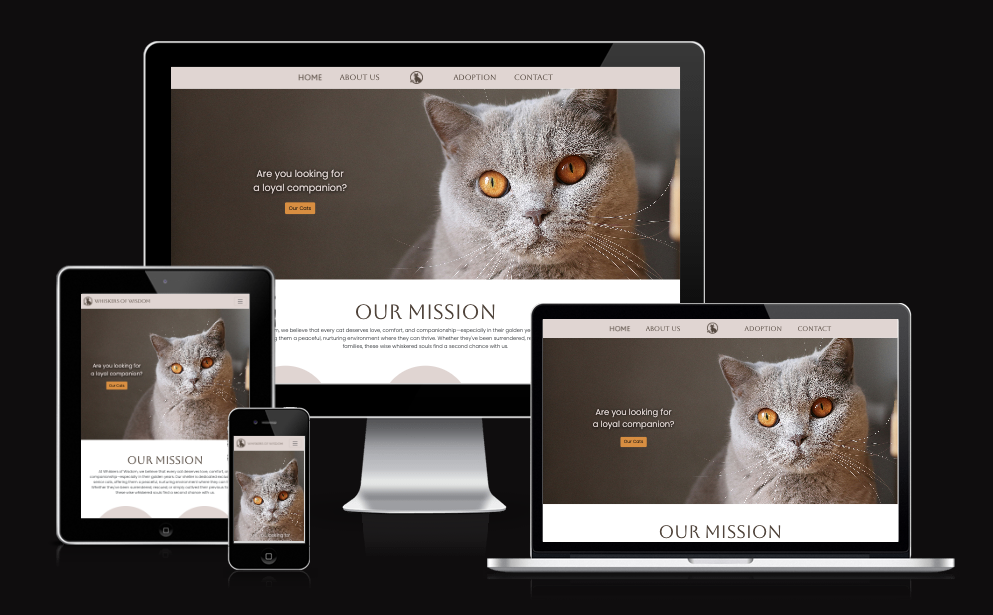
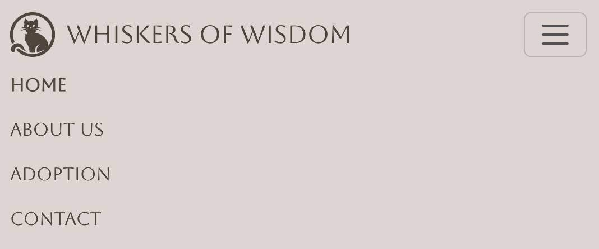

# Whiskers of Wisdom

Whiskers of Wisdom is my first Milestone Project created for Code Institute Level 5 Diploma in Web Application Development. 

Link to deployed site: [Whiskers of Wisdom](https://ssannejohansson.github.io/MS1-adopt-a-senior/)

## Contents

- [User Experience (UX)](#user-experience-ux)
    - [Project Goals](#project-goals)
    - [User Stories](#user-stories)
- [Design](#design)
    - [Color Scheme](#colour-scheme)
    - [Typography](#typography)
    - [Imagery](#imagery)
    - [Wireframes](#wireframes)
    - [Genreal Features](#general-features-on-each-page)
    - [Future Implementations](#future-implentations)
- [Technologies Used](#technologies-used)
    - [Languages Used](#languages-used)
    - [Frameworks Used](#frameworks-used)
    - [Programs Used](#programs-used)
- [Deployment & Local Development](#deployment--local-development)
    - [Deployment](#deployment)
    - [Local Development](#local-development)
- [Testing](#testing)
    - [Automated Testing](#automated-testing)
    - [Manual Testing](#manual-testing)
    - [Bugs](#bugs)
- [Credits](#credits)
    - [Code Used](#code-used)
    - [Content](#content)
    - [Media](#media)

## User Experience (UX)

### Project Goals
As a animal lover who has adopted two senior cats who never got choosen due to their age from a shelter, I wanted to create a webpage especially for us who is passionated by giving the overlooked ones a loving home. 

The goal was to make a visually appealing yet clean website that meets the users need without being cluttered. 

#### Key information for the site
- Senior cats available for adoption
- Contact-form for adoption, need for rehoming and guidance 
- Possibilities to support the organisation
- Care-tips for elderly cats

### User Stories

#### Client Goals

##### First Time Visitor Goals
- I want to find a senior cat to adopt
- I want to know more about caring for elderly cats
- I need to rehome my senior cat

##### Returning Visitor Goals
- I want to see if there is new cats available for adoption 
- I need guidance on how to take care of my new adoptee
- I want to read heartwarming success stories to keep my motivation since I'm having a hard time 

##### Frequent Visitor Goals
- I want to share my success story. 
- I want to support the shelter. 

#### Moscow Prioritization
##### Must Have
- A responsive website that looks and functions well on all screensizes 
- A Navigation that is obvious to the user 
- Clean, focused design that clearly communicates our mission without unneccessary clutter
- Search Engine Optimization (SEO) tailored that makes people who specifically looking for senior cats find us 
- A contact form with easy-to-select topics to make inquiries reach the right team-member 

##### Should Have
- Information on how to take care of elderly cats 
- Information about preparation before adopting a cat 

##### Could Have
- Heartwarming success stories of rehomed cats 
- A newsletter 

## Design

### Colour Scheme

For color scheme, I took inspiration from the hero-image on the front page to generate a scheme that looked good. For this, I used [Muzli Colors](https://colors.muz.li/). 

### Typography

I used Google Fonts for the typography.

For headings, I used [Aboreto](https://fonts.google.com/specimen/Aboreto?query=aboreto). I choose this font because of it's simple but yet fancy look since I didn't want it to stand out to much and make the look of the website unprofessional.

For bodytext, I used [Poppins Light](https://fonts.google.com/specimen/Poppins?query=poppins) since I wanted the font weight to match the Aboreto font, and to make the website look clean and the text easy to read. 

### Imagery

For all imagery, everything from logos to images, I've choosen clean and simple looks to keep the website from feeling cluttered. Please see the Technologies Used section for sources.

All images are downloaded from [Unsplash](https://unsplash.com/). Please see the credits section for attributions. 

### Wireframes

Wireframes are created using [Balsamiq](https://balsamiq.com/). 

Home Page

Adoption Page

Contact Page

Success / Thank you page

### General features on each page
**Favicon**  
The favicon is converted from the [Logo](https://www.vecteezy.com/vector-art/65580867-cat-silhouette-art-illustration-with-white-backgroun)  using [Favicon.io](https://favicon.io/favicon-converter/). 

**Navbar**  
The navbar is created from a [Bootstrap](https://getbootstrap.com) navbar that I later styled. For example, I moved the logo to the center instead of to the left to make it look consistent to the rest of the website. The navbar is fully responsive and I chose to position the links in the open nav to the left to follow the consistency of the logo and text.  

**Footer**  
The footer is created using a [Bootstrap](https://getbootstrap.com) grid to make it fully responsive. At desktop, it's a two-column-layout and from tablet to mobile it comes down to one column.  

### Future Implentations
- In the future, I will add a section at the adoption page dedicated for **success stories** due to meet the user stories. Even further, this could develop into a separate forum-page for people to write stories, share pictures and encouragements. 

- In a later update I'll also be adding a newsletter. This will function through a "Sign up for our newsletter" button that will trigger a modal where you can sign up for the newsletter. The newsletter will include new cats at the shelter, previous adoptions, success stories and guidance.

- Throughout the whole process of this site, I've had accessibility in mind. I've used semantic The Lighthouse report, see further down, is giving great scores but in the next update I will focus on making it even better. 

## Technologies Used

### Languages Used
HTML and CSS. 

### Frameworks Used
[Bootstrap](https://getbootstrap.com) - version 5.3 - CSS Framework. 

### Programs Used
[Balsamiq](https://balsamiq.com/) - Used to create Wireframes. 

[Git](https://git-scm.com/) - For version conrol. 

[Github](https://github.com/) - To store the site online and deploy the website. 

[Vecteezy](https://www.vecteezy.com/) - For logo.

[Vecteezy Background Remover](https://www.vecteezy.com/background-removal) - To remove background on logo.

[Flowpoint Color Changer](https://flowpoint.ai/tools/logo-color-changer) - To change color on logo. 

[Favicon.io](https://favicon.io/favicon-converter/) - To create favicon. 

[Google Fonts](https://fonts.google.com/) To import the fonts used on the website. 

[Font Awesome](https://fontawesome.com/) and [Flaticon](https://www.flaticon.com/) - For icons used on the website.

[Unsplash](https://unsplash.com/) - For images. 

[Tiny PNG](https://tinypng.com/) - To compress images.

[Color Palette Generator](https://colors.muz.li/) - To generate color palette from image.

[Contrast Checker](https://coolors.co/contrast-checker/112a46-acc8e5) - To check contrast between background and text on website. 

[Am I Responsive?](https://ui.dev/amiresponsive) - To show the website on all devices.

## Deployment & Local Development
### Deployment
I've used GitHub Pages to deploy this site. To deploy a site on GitHub Pages you'll need to  
1. Go to your project repository on GitHub.
2. Click on **Settings** in the navigation. 
3. Click on **Pages** in the left section. 
4. Choose what branch to deploy at the **Source** dropdown. 
5. Choose which folder you want to deploy.
6. Click Save and wait a few minutes for the site to deploy. 
7. When the site is deployed, you can find it under **Deployments** in the right section of your repository page. 

### Local Development 
**How to Fork**

To fork the repository, log in to your GitHub account, go to the repository of the project you want to fork [this one](https://github.com/ssannejohansson/MS1-adopt-a-senior.git) for this project, and click on the Fork button in the top right corner. 

**How to Clone**

To clone the repository, log in your GitHub accout, go to the repository of the project you want to clone [this one](https://github.com/ssannejohansson/MS1-adopt-a-senior.git) for this project, click on the **Code** button and select if you want to clone with HTTPS, SSH or GitHub CLI and copy the code. Open the **terminal** in your code editor and change directory to the location you want to use for the cloned directory and type *git clone* into the terminal and paste the link you copied. Press **enter**. 

## Testing

### Automated testing

#### W3C Validator
I used [W3C Markup Validator](https://validator.w3.org/) and [W3C CSS Validator](https://jigsaw.w3.org/css-validator/) to validate the HTML and CSS on all pages of the website. 

- **Home page** - No errors or warnings. 
- **Adoption page** - Error with the flip-card code.
 
*Since I don't have a solution for this and everything is working in manual testing, I've decided to leave this error.*
- **Contact page** - No errors or warnings. 
- **Success page** - No errors or warnings.
- **Thank you page** - No errors or warnings. 
- **CSS** - No errors or warnings. 

#### Lighthouse
I used the Chrome Developer Tool Lighthouse to test performance, accessibility, best practises and SEO of the website. I run the test for both desktop and mobile. 

Home page

Desktop 
     
Mobile 
    ¨

Adoption page

 Desktop 
     
Mobile 
    
    

Contact page
 
Desktop 
     
Mobile 
    
    

Success page

Desktop 
     
Mobile 
    
    

Thank you page

Desktop 
     
Mobile 
    
    

 

Overall, the accessibility, best practises and SEO results are great. 

The orange performance numbers are mostly due to image-sizes even though I compressed them with TinyPNG. In future projects, I will look into other ways of compressing images to get a better performance. 

The reason that the accessibility isn't perfect is mostly because of the color of the attributions in the footer. I choose to keep the color because i don't want the attributions to take focus from the other elements in the footer.  

### Manual testing

#### Testing Client Goals
| Moscow Prioritization | Goal | Status |
| --- | ----------- | --- |
| **Must Have** | A responsive website that looks and functions well on all screensizes | **Done**|
| **Must Have** | A Navigation that is obvious to the user  | **Done** |
| **Must Have** | Clean, focused design that clearly communicates our mission without unneccessary clutter | **Done** |
| **Must Have** | Search Engine Optimization (SEO) tailored that makes people who specifically looking for senior cats find us | **Done** |
| **Must Have** | A contact form with easy-to-select topics to make inquiries reach the right team-member | **Done** |
| **Should Have** | Information on how to take care of elderly cats | **Done** |
| **Should Have** | Information about preparation before adopting a cat | **Done** |
| **Could Have** | Heartwarming success stories of rehomed cats | *Next version* |
| **Could Have** | A newsletter | *Next version*  |

#### Full testing
Full testing was performed on the folliwing devices:
- Laptop 
    - MacBook Air M2 2022, 13.6 inch screen
- External Display
    - Apple Thunderbolt Display, 27 inch screen

- Mobile Device
    - Iphone 16 Pro Max, 6.9 inch screen

Additional testing was done using Google Chromes inspection tool to test XS-Phone and Tablet. 

Each device tested the site using the following browsers:
- Google Chrome
- Safari 
- Firefox 

| Page | Feature | Expected Outcome | Action | Pass / Fail |
| ----------- | ----------- | ----------- | ----------- | ----------- | 
| All | **Nav links** | When clicked, the respective page or section will open and the active page will be bold | Clicked all navbar-links | Pass | 
| All | **Nav logo** | When clicked, home page will open | Clicked logo Icon | Pass | 
| All | **Footer contact link** | When clicked, contact page will open | Clicked link | Pass |
| All | **Footer social links** | When clicked, the respective social page will open in a new tab | Clicked links | Pass |
| All | **Footer support us button** | When clicked, thank you page will open | Clicked link | Pass |
| All | **Footer attributions** | When clicked, the respective attribution-page will open | Clicked links | Pass |
| All | **Hovers** | When hovering, all buttons and links will have a hover-effect to show that they are focused | Hovered over links and buttons | Pass |
| Home | **Hero button** | When clicked, page will scroll down to carousel showing available cats | Clicked button | Pass |
| Home | **Our Mission buttons** | When clicked, the respective section or page will open | Clicked buttons | Pass |
| Home | **Left and right buttons in carousel** | When clicked, the images will scroll left or right | Clicked the arrows | Pass |
| Home | **Hovers** | When hovering, all buttons and links will have a hover-effect to show that they are focused | Hovered over links and buttons | Pass |
| Adoption | **Contact form Button** | When clicked, the contact page will open | Clicked button | Pass |
| Adoption | **Flip Cards** | When clicked, the cards will turn to show information about the cats | Clicked cards | Pass |
| Adoption | **Hovers** | When hovering, all buttons and links will have a hover-effect to show that they are focused | Hovered over links and buttons | Pass |
| Contact | **Inputs** | When clicked, all inputs will have a bold border to show that they are focused | Clicked inputs | Pass |
| Contact | **Radio buttons** | When clicked, all radio buttons will work | Clicked radio buttons | Pass |
| Contact | **Submit button** | When clicked, success page will open | Filled out form and clicked the button | Pass |
| Contact | **Form Validation** | It's not possible to submit the contact form if inputs are blank or if a @ is missing in email-input | Filled out input by input to and clicked submit | Pass |
| Contact | **Hovers** | When hovering, all buttons and links will have a hover-effect to show that they are focused | Hovered over links and buttons | Pass |
| Success | **Return to homepage** | When clicked, home page will open | Clicked button | Pass |
| Success | **Hovers** | When hovering, all buttons and links will have a hover-effect to show that they are focused | Hovered over links and buttons | Pass |
| Thank You | **Return to homepage** | When clicked, home page will open | Clicked button | Pass |
| Thank You | **Hovers** | When hovering, all buttons and links will have a hover-effect to show that they are focused |Hovered over links and buttons | Pass |

### Bugs

#### Solved Bugs

| Bug | How I solved it |
| ----------- | ----------- |
| On mobile, a line appeared between the shape-divider and heading for the "Are You Prepared?" section at home page. | Added a margin-bottom of 1px on the section to move the background-color of the section 1px up. This made the line move to the top, so I needed to add -1px margin-top too to fix that. |
| The About-link in the navbar does not work from other pages than home page.| Added index.html before #about to make it direct to index.html and then the section (index.html#about). |
| On mobile, the heart-shaped image at the success-page is too large and does not show properly. | Added the img-fluid bootstrap class to image to make it responsive. |

## Credits

### Code Used
[CSS Generator Tool](https://cssgenerator.org/) - For generating box-shadow and text-shadow. 

[Shapedivider App](https://www.shapedivider.app/) - For dividers between section. 

[CSS Filter Generator](https://codepen.io/sosuke/pen/Pjoqqp) - Filter generator by **Barrett Sonntag** to generate a filter to change color on radio-buttons. 

[Heart Images](https://codepen.io/t_afif/pen/PoRwjPM) - Code by **Temani Afif** for heart-shaped images. 

[Flip Cards](https://codepen.io/nicolaskadis/pen/bOLEEd) - Code by **Nicolas Kadis** for cards that flip on click.

### Content

All written content (and the business-name) are generated by [ChatGPT](https://chatgpt.com/?openaicom_referred=true).

### Media

[Logo](https://www.vecteezy.com/vector-art/65580867-cat-silhouette-art-illustration-with-white-backgroun) - Mohiuddin Ahamad.

[Hero Image on Front-page](https://unsplash.com/photos/rules-of-third-photography-of-orange-eyed-gray-cat-FT9SsFEXqF4) - Krystian Tambur. 

[Hero Image on Adoption-page](https://unsplash.com/photos/a-close-up-of-a-person-holding-a-cat-uVPh6P6sDeo) - Kateryna Hliznitsova.

[Image on Thank You-page](https://unsplash.com/photos/tabby-cat-touching-persons-palm-xulIYVIbYIc) - Jonas Vincent. 

["Matilda"](https://unsplash.com/photos/a-black-and-white-cat-walking-across-a-wooden-floor-pa8ChQr5R5A) - Elīza Švampe.

["Constance"](https://unsplash.com/photos/a-cat-sitting-on-top-of-a-scratching-post-Y6Y8KpePX1s) - Emilie Durand. 

["Pearl"](https://unsplash.com/photos/a-black-and-white-cat-sitting-under-a-chair-J_fMXX6issw) - Jack Plant. 

["Henry"](https://unsplash.com/photos/a-cat-laying-in-a-cat-bed-on-the-floor-zxh1PQ8CTBs) - Konstantin Kitsenuik.

["Bob"](https://unsplash.com/photos/a-cat-laying-on-top-of-a-scratching-post-Kb1oVYH7xWk) - Osama Madlom.
